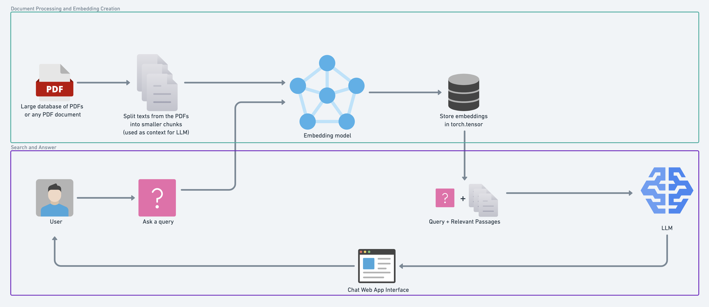

# Textbook Chatbot Using RAG Pipeline

#### RAG Pipeline Workflow That Is Used For Chatbot



The workflow resembles the paper: [Retrieval-Augmented Generation for Knowledge-Intensive NLP Tasks.](https://arxiv.org/abs/2005.11401)

#### **Step-by-step building workflow:**

1. Open a PDF document (I'm using the "handbook-of-international-law.pdf" for demo purpose.)
2. Format the text of the PDF (splitting into chunks) for an embedding model.
3. Embed all the chunks (turn the texts into numerical representation which can be stored for later.)
4. Build a retrieval system with vector search to find relevant chunks based on an input query.
5. Create a prompt that incorporates the retrieved texts.
6. Generate an answer to a query based on texts from the PDF.
7. Deploy the system to a web app interface.

### Getting Started

> **Note:** All designed to run locally on an NVIDIA GPU with `cuda` support.

Two main options:

1. NVIDIA GPU with 5GB+ VRAM (use `nvidia-smi` on terminal to check).
2. Google Colab with a GPU runtime or TPU runtime.

### Setup

#### Clone Repository

```
git clone https://github.com/jumelies/international-law-chatbot.git
```

```
cd international-law-chatbot
```

#### Create An Environment

**[Conda](https://www.anaconda.com/)**

```
conda create --name <environment-name>
```

#### Activate Environment

```
conda activate <environment-name>
```

#### Install Requirements

```
pip3 install -r requirements.txt
```

#### Launch The Notebook

```
jupyter notebook
```

#### Selecting the Right Model

Two options:

1. Run through an API
2. Run locally

With the first option, you can use API such as GPT-4 or Claude 3. However, this comes with the tradeoff of sending your data away and then awaiting a response.

When it comes to running a model locally, you should choose model that best suitable with the hardware you are currently having.

The following table gives an insight into how much GPU memory you'll need to load an LLM with different sizes and different levels of [numerical precision](<https://en.wikipedia.org/wiki/Precision_(computer_science)>). They are based on the fact that 1 float32 value (e.g. `0.69420`) requires 4 bytes of memory and 1GB is approximately 1,000,000,000 (one billion) bytes.

| Model Size (Billion Parameters)                                                                                                                                                             | Float32 VRAM (GB) | Float16 VRAM (GB) | 8-bit VRAM (GB) | 4-bit VRAM (GB) |
| ------------------------------------------------------------------------------------------------------------------------------------------------------------------------------------------- | ----------------- | ----------------- | --------------- | --------------- |
| 1B                                                                                                                                                                                          | ~4                | ~2                | ~1              | ~0.5            |
| 7B (e.g. [Llama 2 7B](https://huggingface.co/meta-llama/Llama-2-7b), [Gemma 7B](https://huggingface.co/google/gemma-7b-it), [Mistral 7B](https://huggingface.co/mistralai/Mistral-7B-v0.1)) | ~28               | ~14               | ~7              | ~3.5            |
| 10B                                                                                                                                                                                         | ~40               | ~20               | ~10             | ~5              |
| 70B (e.g. Llama 2 70B)                                                                                                                                                                      | ~280              | ~140              | ~70             | ~35             |
| 100B                                                                                                                                                                                        | ~400              | ~200              | ~100            | ~50             |
| 175B                                                                                                                                                                                        | ~700              | ~350              | ~175            | ~87.5           |

> **Note:** Loading a model in a lower precision (e.g. 8-bit instead of float16) generally lowers performance. Lower precision can help to reduce computing requirements, however sometimes the performance degradation in terms of model output can be substantial. Finding the right speed/performance tradeoff will often require many experiments.

The model I'm choosing is `google/gemma-2b-it` since I'm running this notebook on Google Colab. But you can choose model that best fit with your hardware.

| Model                                                 | Precision | Min-Memory (Bytes) | Min-Memory (MB) | Min-Memory (GB) | Recommended Memory (GB) | Hugging Face ID                                                                                                                                  |
| ----------------------------------------------------- | --------- | ------------------ | --------------- | --------------- | ----------------------- | ------------------------------------------------------------------------------------------------------------------------------------------------ |
| [Gemma 2B](https://huggingface.co/google/gemma-2b-it) | 4-bit     | 2,106,749,952      | 2009.15         | 1.96            | ~5.0                    | [`gemma-2b`](https://huggingface.co/google/gemma-2b) or [`gemma-2b-it`](https://huggingface.co/google/gemma-2b-it) for instruction tuned version |
| Gemma 2B                                              | Float16   | 5,079,453,696      | 4844.14         | 4.73            | ~8.0                    | Same as above                                                                                                                                    |

#### Setup Note:

- If there is any troubles with the setup, please leave an issue.
- To use more varieties of models on [Hugging Face](https://huggingface.co/), you will need to authorize your local machine via [Hugging Face CLI](https://huggingface.co/docs/huggingface_hub/en/quick-start#authentication), otherwise an HTTPError or an OSError may occur.
- If you're not comfortable with logging into Hugging Face, you can change the model to [`microsoft/Phi-3`](https://huggingface.co/collections/microsoft/phi-3-6626e15e9585a200d2d761e3) models since I tested on it.
- If you change the model, consider the output text template in the model page and change the `output-text` in the notebook according to it.
- If you want to try modified models (models that are either made smaller or made to use for specific purposes: like uncensored the content, or to code solely), consider visiting: [Tom Jobbins](https://huggingface.co/TheBloke)
